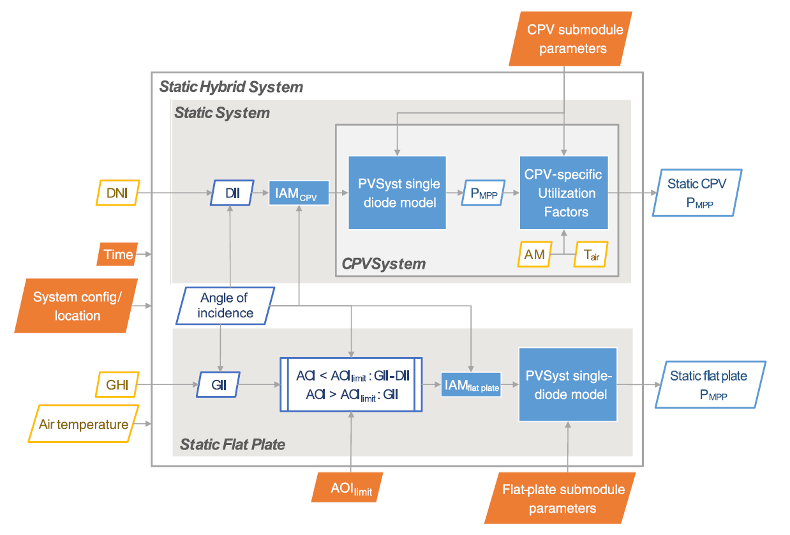

# cpvlib  https://readthedocs.org/projects/cpvlib/badge/?version=latest&style=plastic 

The `cpvlib` library is a layer over [`pvlib-python`](https://github.com/pvlib/pvlib-python) that models CPV systems.

It is built in file `cpvlib.py`, that contains the `cpvsystem` module with following classes:

* CPVSystem
* StaticCPVSystem
* StaticFlatPlateSystem
* StaticHybridSystem

A more detailed description can be found in the Documentation at [readthedocs](http://cpvlib.readthedocs.io).

## Library installation & usage

*Pre-release installation*
`pip install --force-reinstall --no-deps git+https://github.com/isi-ies-group/cpvlib.git`

`from cpvlib import cpvsystem`
`cpvsystem.StaticHybridSystem(...)`

## License

TBD

## Live Jupyter notebook demo
StaticHybridSystem_tmy.ipynb
<!---* Binder 
--->
* Google Colab 

<!---
*Testing dataset* 
--->
