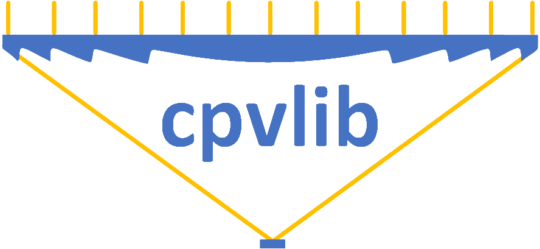
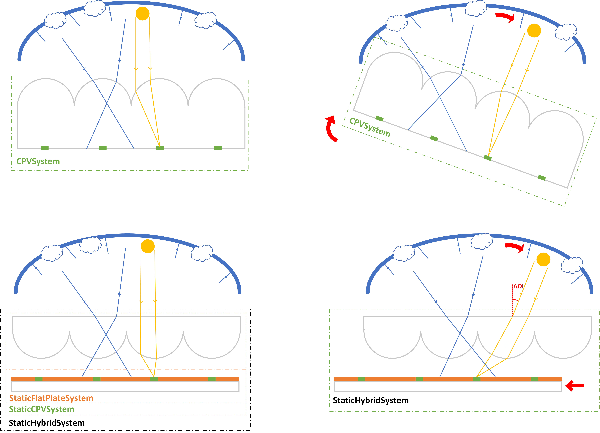

# cpvlib

`cpvlib` is a python package for modeling CPV systems built as a layer over [`pvlib-python`](https://github.com/pvlib/pvlib-python).

It is built in file `cpvlib.py`, that contains the `cpvsystem` module with following classes:

* CPVSystem
* StaticCPVSystem
* StaticFlatPlateSystem
* StaticHybridSystem

A more detailed description can be found in the Documentation at [readthedocs](http://cpvlib.readthedocs.io).

## Library installation & usage

*Installation from source*
`pip install --force-reinstall --no-deps git+https://github.com/isi-ies-group/cpvlib.git`

`from cpvlib import cpvsystem`
`cpvsystem.StaticHybridSystem(...)`

## Contributing

Please see the [Contributing page](http://cpvlib.readthedocs.io/en/latest/contributing.html) for more on how you can contribute.
 
## License

TBD

## Getting support

If you suspect that you may have discovered a bug or if you'd like to
change something about cpvlib, then please make an issue on the
[GitHub issues page](https://github.com/isi-ies-group/issues).

## Live Jupyter notebook demo
StaticHybridSystem_tmy.ipynb
<!---* Binder 
--->
* Google Colab 

<!---
*Testing dataset* 
--->
