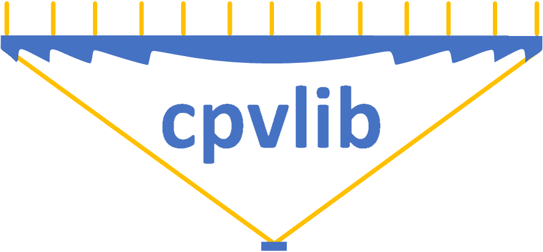

cpvlib
======

cpvlib library is a layer over `pvlib-python
<https://github.com/pvlib/pvlib-python/>`_ that provides a set of
functions and classes for simulating the performance of concentrator
photovoltaic energy systems.

The source code for cpvlib python is hosted on `github
<https://github.com/isi-ies-group/cpvlib/>`_.

Installation from source
    `pip install --force-reinstall --no-deps git+https://github.com/isi-ies-group/cpvlib.git`

For examples of how to use cpvlib, please see :ref:`package_overview`.

..
    and our `Jupyter Notebook tutorials
    <https://nbviewer.jupyter.org/github/isi-ies-group/cpvlib/tree/master/docs/examples/>`_.

The documentation assumes general familiarity with Python, NumPy, and Pandas.

Contents
========

.. toctree::
   :maxdepth: 2

   package_overview
   introtutorial
   contributing
   whatsnew
   cpvlib.cpvsystem

API
===

Classes
-------

The `cpvsystem` module provides the following classes. See its documentation for details.

.. autosummary::
   :toctree: /

   cpvlib.cpvsystem.CPVSystem
   cpvlib.cpvsystem.StaticCPVSystem
   cpvlib.cpvsystem.StaticFlatPlateSystem
   cpvlib.cpvsystem.StaticHybridSystem

Indices and tables
==================

* :ref:`genindex`
* :ref:`search`
