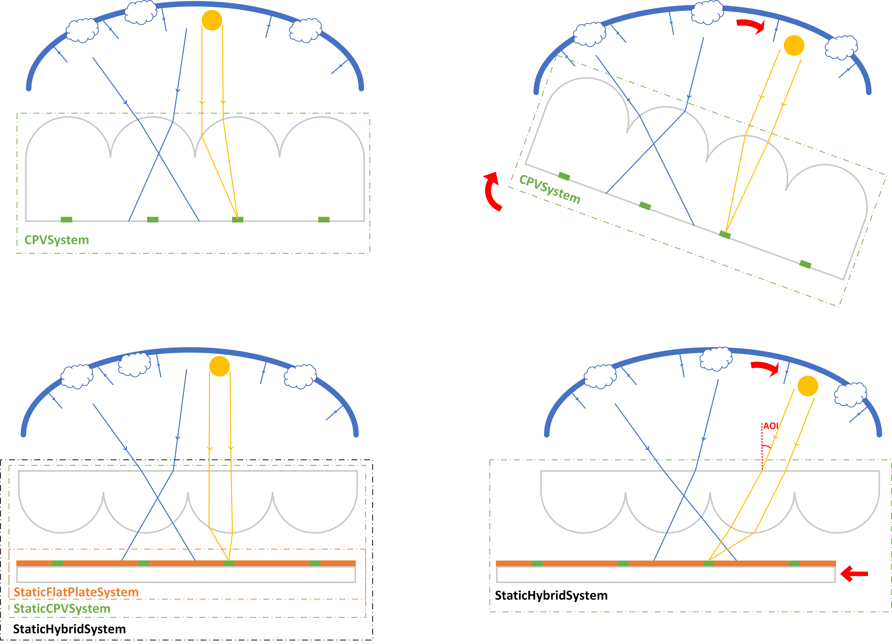
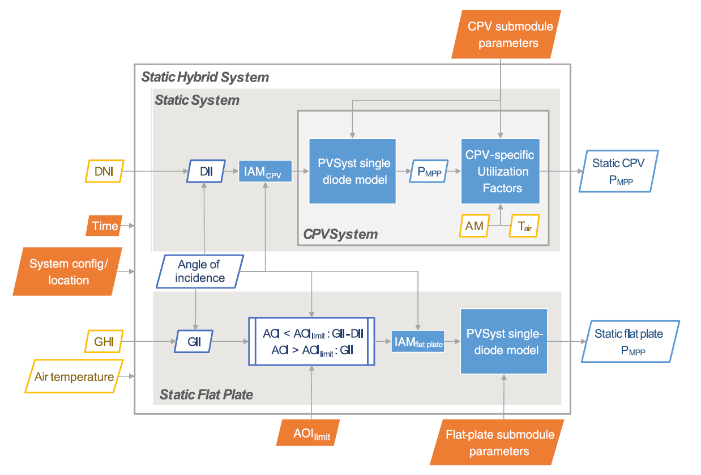

.. _introtutorial:

Intro Tutorial
==============

This page contains introductory examples of cpvlib usage.

Here you can find an example based on a Jupyter notebook ready to be launched:

..
.. COMMENT image:: https://mybinder.org/badge_logo.svg
.. COMMENT :target: https://mybinder.org/v2/gh/isi-ies-group/cpvlib/master?filepath=docs/examples/StaticHybridSystem_tmy.ipynb

.. image:: https://colab.research.google.com/assets/colab-badge.svg
   :target: https://colab.research.google.com/github/isi-ies-group/cpvlib/blob/master/docs/examples/StaticHybridSystem_tmy.ipynb

The example code is detailed below:

.. literalinclude:: ../examples/StaticHybridSystem_tmy.py
